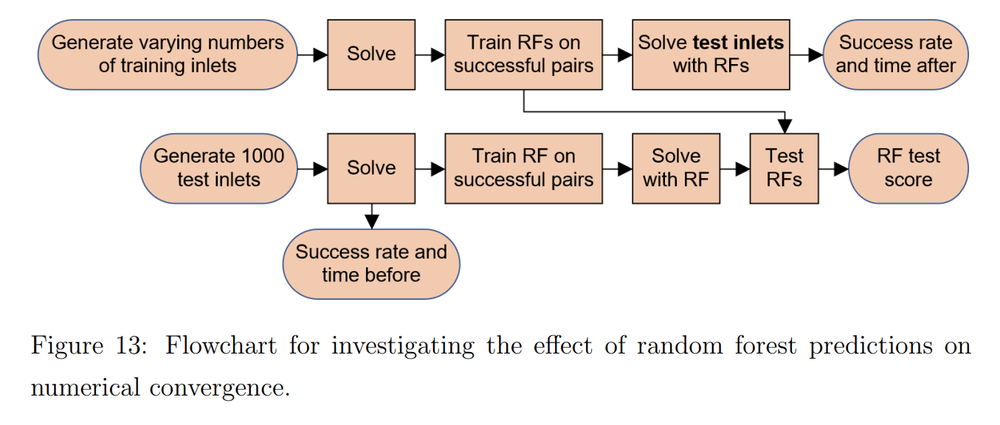

# machine-learning-for-process-simulation

This project was for my Master's thesis, which is here: https://drive.google.com/file/d/13_XyWe7enZe6xv0YRAvlKbVM2hDsGTNA/view?usp=share_link

This project was split into three parts of investigation. The results are as follows:

## Part 1: Surrogate modelling a chemical process using ML algorithms

Accuracy and speed of surrogate modelling for three different ML algorithms (random forests, Gaussian processes and neural networks) and 3 different sampling techniques (random, stratified, latin hypercube).

In this part, the physical system being surrogate modelled was an ethylene oxide plug flow reactor.

## Part 2: Using random forests to improve numerical solver convergence

Use of a random forest surrogate model to provide initial guesses for numerical solution, in order to improve the success rate for convergence across the input parameter space.

In this part, the physical system being surrogate modelled was an ethylene oxide flash drum.

## Part 3: Using random forests to aid process optimization

Use of random forest regression to surrogate model the objective function resulting from a non-linear optimization. Use of random forest classification to predict the convergence status of an optimization, thus saving time by avoiding infeasible initial conditions.

In this part, the physical system being surrogate modelled was the purification section of an ethylene oxide process plant, consisting of a distillation column, absorption column, valve, heat exchanger and recycle stream.

## Instructions to build and run:

The following packages should be installed:

Python 3.8.3
Pyomo 5.7.3
IPOPT 3.11.1
pandas 1.0.5
scikit-learn 0.23.1
Keras 2.10.0
NumPy 1.23.2
SciPy 1.9.1
matplotlib 3.2.2
seaborn 0.10.1
